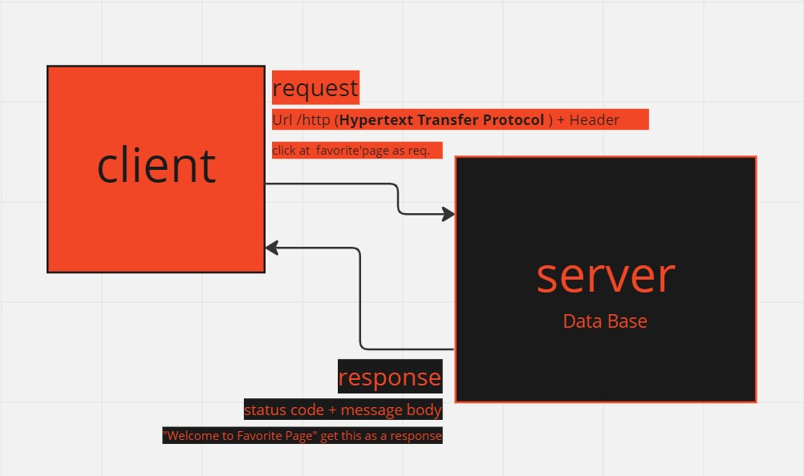

# Movies-Library
#  MovieCargo - Your space for best watching

**Author Name**: Sara Alkhateeb

## WRRC

## Overview
This project is a movie library application that allows users to browse and search for movies, as well as view details about each movie such as the title, release year, and synopsis.

## Getting Started
To build and run this app on your own machine, follow these steps:

* Clone the project repository to your local machine using Git
* Install the necessary dependencies by running npm install in the project directory
* Start the development server by running npm start
* Open your web browser and navigate to http://localhost:3000 to view the app

## Project Features
1. Browse movies by genre, release year, or title
2. Search for movies by title or keyword
3. View details about each movie, including the title, release year, and synopsis
4. Add movies to a favorites list for easy access later
5. Mark movies as watched or unwatched